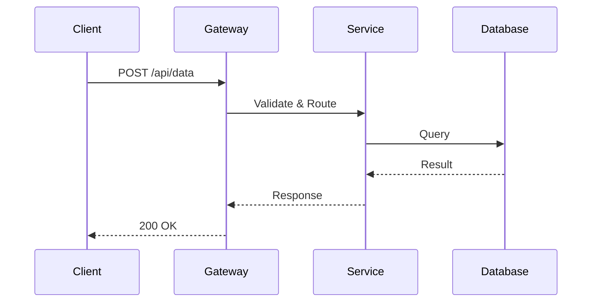
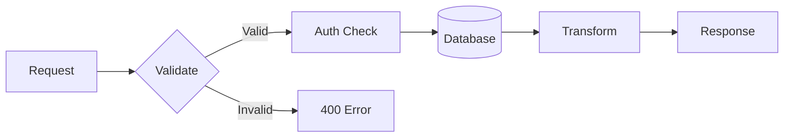
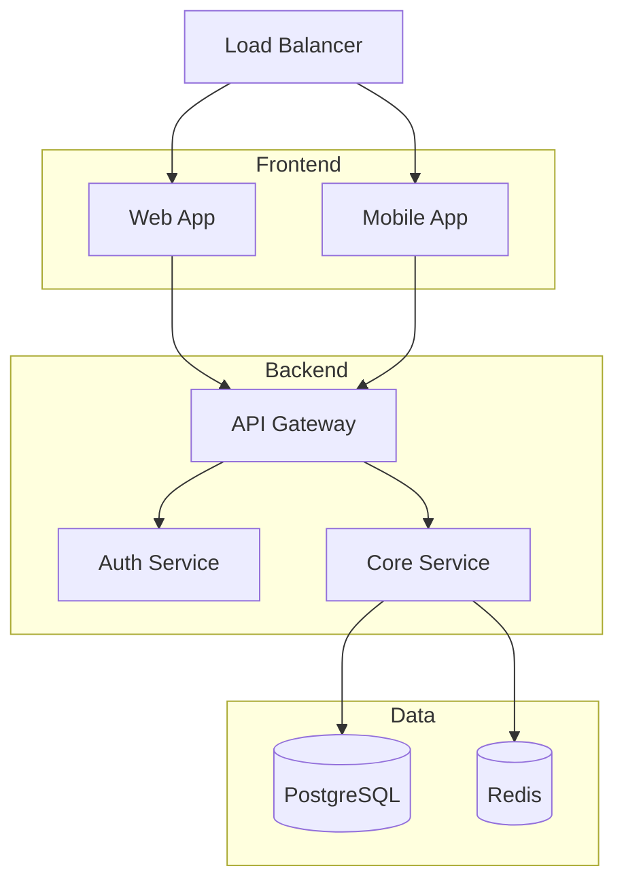
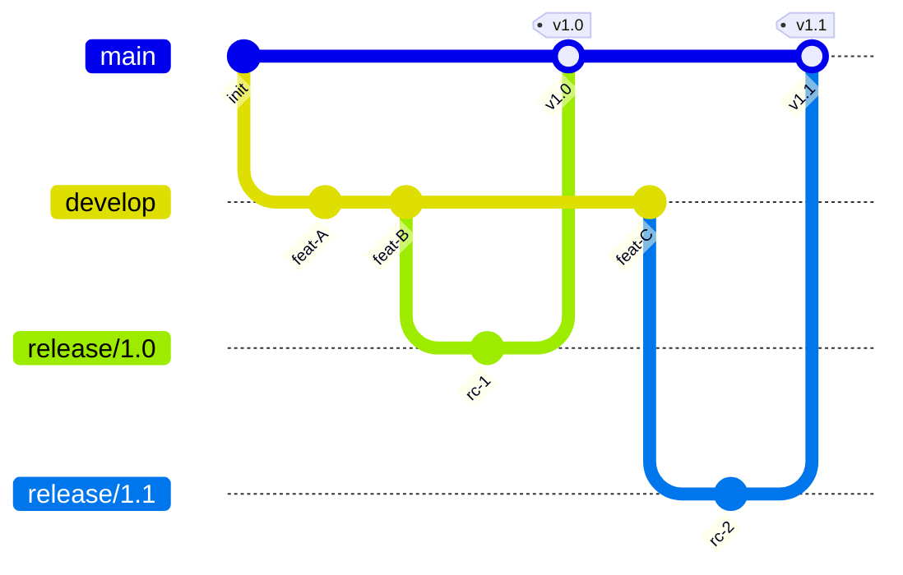
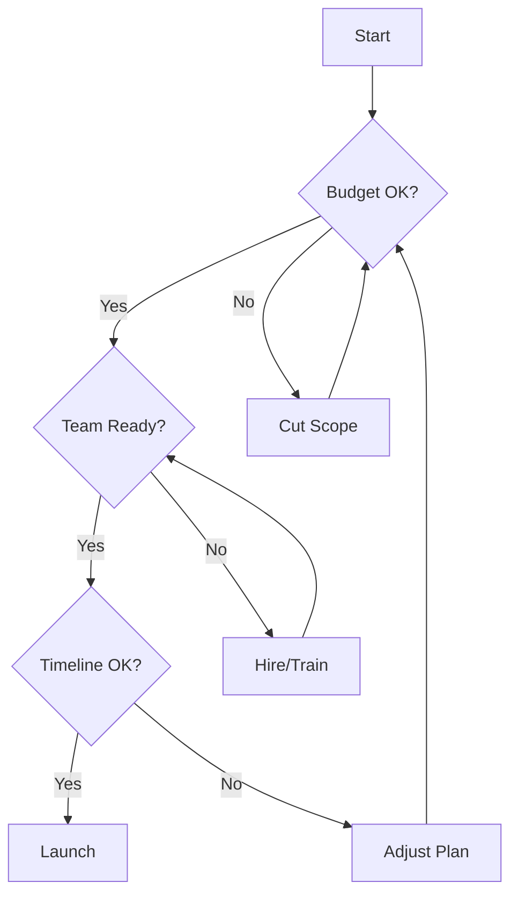
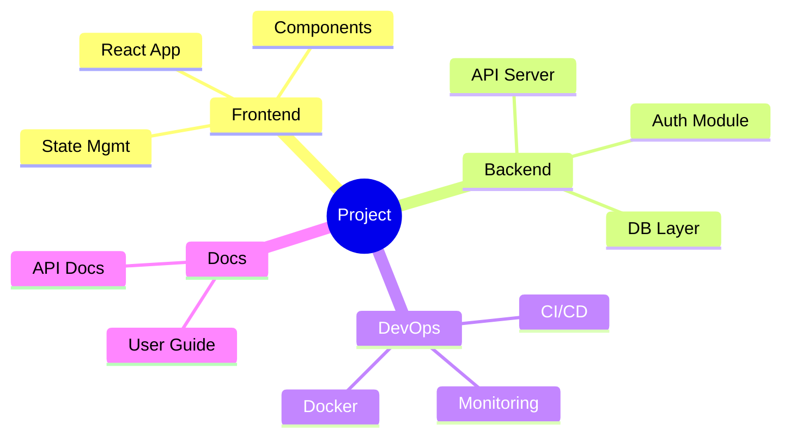

# Diagram Templates

Ready-to-use Mermaid templates rendered with `uvx termaid --gap 1 --padding-x 0`.

---

## 1. API Request Flow (sequenceDiagram)



Rendered output:

```
 ┌──────────┐        ┌──────────┐          ┌──────────┐┌──────────┐
 │  Client  │        │ Gateway  │          │ Service  ││ Database │
 └──────────┘        └──────────┘          └──────────┘└──────────┘
       ┆ POST /api/data    ┆                     ┆           ┆
       ────────────────────►                     ┆           ┆
       ┆                   ┆ Validate & Route    ┆           ┆
       ┆                   ──────────────────────►           ┆
       ┆                   ┆                     ┆ Query     ┆
       ┆                   ┆                     ────────────►
       ┆                   ┆                     ┆ Result    ┆
       ┆                   ┆                     ◄┄┄┄┄┄┄┄┄┄┄┄┄
       ┆                   ┆ Response            ┆           ┆
       ┆                   ◄┄┄┄┄┄┄┄┄┄┄┄┄┄┄┄┄┄┄┄┄┄┄           ┆
       ┆ 200 OK            ┆                     ┆           ┆
       ◄┄┄┄┄┄┄┄┄┄┄┄┄┄┄┄┄┄┄┄┄                     ┆           ┆
       ┆                   ┆                     ┆           ┆
```

---

## 2. CRUD Pipeline (flowchart LR)



Rendered output:

```
┌───────┐ ┌────◇───┐        ┌──────────┐ ╭────────╮ ┌─────────┐ ┌────────┐
│       │ │        │ Valid  │          │ ╰────────╯ │         │ │        │
│Request├►│Validate├────┬──►│Auth Check├►│Database├►│Transform├►│Response│
│       │ │        │    │   │          │ │        │ │         │ │        │
└───────┘ └────◇───┘    │   └──────────┘ ╰────────╯ └─────────┘ └────────┘
                        │Invalid
                        │   ┌──────────┐
                        │   │          │
                        ╰──►│400 Error │
                            │          │
                            └──────────┘
```

---

## 3. Microservice Architecture (flowchart TD with subgraphs)



Rendered output:

```
   ┌─────────────┐
   │             │
   │Load Balancer│
   │             │
   └──────┬──────┘
          │
 ┌────────┼────────────────────────┐
 │ Frontend───────────────╮        │
 │        │               │        │
 │        ▼               ▼        │
 │ ┌─────────────┐ ┌─────────────┐ │
 │ │             │ │             │ │
 │ │   Web App   │ │ Mobile App  │ │
 │ │             │ │             │ │
 │ └─────┬───────┘ └──────┬──────┘ │
 │       │                │        │
 └───────┼────────────────┼────────┘
         │                │
         │                │
         │                │
         │ ╭──────────────╯
 ┌───────┼─┼───────────────────────┐
 │ Backend │                       │
 │       │ │                       │
 │       ▼ ▼                       │
 │ ┌─────────────┐                 │
 │ │             │                 │
 │ │ API Gateway │                 │
 │ │             │                 │
 │ └──────┬──────┘                 │
 │        ▼───────────────▼        │
 │ ┌─────────────┐ ┌─────────────┐ │
 │ │             │ │             │ │
 │ │Auth Service │ │Core Service │ │
 │ │             │ │             │ │
 │ └─────────────┘ └──────┬──────┘ │
 │                        │        │
 └────────────────────────┼────────┘
                          │
                          │
                          │
          ╭───────────────┤
 ┌────────┼───────────────┼────────┐
 │ Data   │               │        │
 │        │               │        │
 │        ▼               ▼        │
 │ ╭─────────────╮ ╭─────────────╮ │
 │ ╰─────────────╯ ╰─────────────╯ │
 │ │ PostgreSQL  │ │    Redis    │ │
 │ │             │ │             │ │
 │ ╰─────────────╯ ╰─────────────╯ │
 │                                 │
 └─────────────────────────────────┘
```

---

## 4. Git Release Flow (gitGraph)



Rendered output:

```
                                           [v1.0]                [v1.1]
  main        ───●──────┼─────────────────────●─────────────────────●─
               init     │                   v1.0                  v1.1
                        │                     │                     │
  develop               ●───────●──────┼──────┼───────●──────┼      │
                     feat-A  feat-B    │      │    feat-C    │      │
                                       │      │              │      │
  release/1.0                          ●──────┼              │      │
                                     rc-1                    │      │
                                                             │      │
  release/1.1                                                ●──────┼
                                                           rc-2
```

---

## 5. Decision Matrix (flowchart TD with diamonds)



Rendered output:

```
┌────────────┐
│            │
│   Start    │
│            │
└──────┬─────┘
       ▼
┌──────◇─────┐  ╭────────────────╮
│            │  │                │
│ Budget OK? │◄─┴───────────────╮│
│            │                  ││
└──────◇─────┘                  ││
       │                        ││
       │                        ││
       ├─────────────────╮      ││
       │                 │No    ││
    Yes│                 │      ││
       │                 │      ││
       ▼                 ▼      ││
┌──────◇─────┐    ┌────────────┐││
│            │    │            │││
│Team Ready? │◄─╮ │ Cut Scope  ├╯│
│            │  │ │            │ │
└──────◇─────┘  │ └────────────┘ │
       │        │                │
       │        │                │
       ├────────┼────────╮       │
       │        │        │No     │
    Yes│        │        │       │
       │        ╰────────┼──────╮│
       ▼                 ▼      ││
┌──────◇─────┐    ┌────────────┐││
│            │    │            │││
│Timeline OK?│    │ Hire/Train ├╯│
│            │    │            │ │
└──────◇─────┘    └────────────┘ │
       │                         │
       │                         │
       ├─────────────────╮       │
    Yes│                 │       │
       │                 │No     │
       ▼                 ▼       │
┌────────────┐    ┌────────────┐ │
│            │    │            │ │
│   Launch   │    │Adjust Plan ├─╯
│            │    │            │
└────────────┘    └────────────┘
```

---

## 6. Project Structure (mindmap)



Rendered output:

```
                                ╭─ React App
                  ╭─ Frontend ──├─ Components
                  │             ╰─ State Mgmt
                  │            ╭─ API Server
                  ├─ Backend ──├─ Auth Module
root((Project)) ──┤            ╰─ DB Layer
                  │           ╭─ CI/CD
                  ├─ DevOps ──├─ Docker
                  │           ╰─ Monitoring
                  ╰─ Docs ──╭─ API Docs
                            ╰─ User Guide
```
