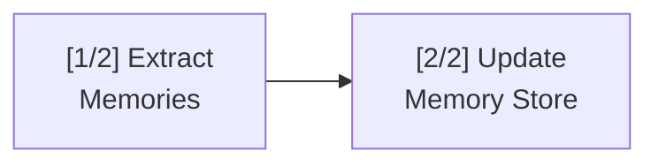

# Diagram

Render Mermaid diagrams in the terminal via `uvx termaid` (zero-install, pure Python, requires Python >= 3.11).

If the default Python is < 3.11, use `uvx --python 3.11 termaid` (or 3.12/3.13).

## Workflow

1. Determine the best diagram type from user request or code context
2. **Language adapt**: use the user's language directly in labels. CJK characters are fully supported since termaid 0.5.0. For bilingual contexts, optionally use `\n` annotation: `A["Quality Gate\n(质量门控)"]`. Response text around the diagram: user's language.
3. Generate valid Mermaid syntax
4. Render via pipe to termaid
5. If output is too wide, re-render with compact options

## Rendering

Always use `scripts/termaid-render.sh` for rendering. It handles compact output (`--gap 1 --padding-x 0`), Python version detection, dark/light auto-theme (macOS), pipefail error handling, and 5-color structural glyphs automatically.

```bash
# DEFAULT: auto-color render script (relative to skill base dir)
bash {baseDir}/scripts/termaid-render.sh <<'EOF'
graph LR; A[Start] --> B{OK?} -->|Yes| C[Done]
EOF

# Plain render (no color, no script dependency)
uvx termaid --gap 1 --padding-x 0 <<'EOF'
...
EOF
```

**Agent path resolution**: determine this SKILL.md file's directory as `{baseDir}`. Common locations: `~/.claude/skills/terminal-diagrams/`, `~/.agents/skills/terminal-diagrams/`, `.codebuddy/skills/terminal-diagrams/`.

Fallback chain if rendering fails: `--ascii` → return Mermaid source with explanation.

## Color Output

Color requires the `rich` extra. Use `--from "termaid[rich]"` with uvx:

```bash
# Force color in non-TTY contexts (pipes, CI, agent tools)
FORCE_COLOR=1 uvx --from "termaid[rich]" termaid --gap 1 --padding-x 0 --theme amber <<'EOF'
graph LR; A --> B --> C
EOF
```

**`FORCE_COLOR=1`**: Rich suppresses color when stdout is not a TTY (pipes, CI, agent tools). Set this env var to force ANSI output.

### Theme Comparison

Available themes: `default`, `terra`, `neon`, `mono`, `amber`, `phosphor`.

| Theme | Borders | Edges | Arrows | Verdict |
|---|---|---|---|---|
| `default` | normal cyan | **dim** white `[2;37m` | bold yellow | Edges invisible on dark bg |
| `neon` | bold magenta | **dim** cyan `[2;36m` | bold green | Edges faint on dark bg |
| `mono` | bold white | **dim** (no color) `[2m` | bold white | Edges nearly invisible |
| `terra` | bold 24-bit terracotta | 24-bit muted brown | bold 24-bit salmon | Warm, muted -- good |
| **`amber`** | **bold 24-bit(255,176,0)** | 24-bit(128,96,0) | **bold 24-bit(255,208,128)** | **Best contrast** |
| `phosphor` | bold 24-bit(51,255,51) | 24-bit(26,140,26) | bold 24-bit(102,255,102) | High contrast, retro |

**Recommendation by background**:
- **Dark terminal** → `amber` (gold on dark = highest contrast)
- **Light terminal** → terminal default text + colored structural glyphs (via render script). Without script: plain render (no color).

**Auto-detect script** (macOS only): `scripts/termaid-render.sh` detects system appearance via `defaults read -g AppleInterfaceStyle`. On Linux/CI/SSH, defaults to light mode — set `TERMAID_THEME=amber` explicitly for dark terminals:
```bash
echo 'graph LR; A --> B' | bash scripts/termaid-render.sh
# Dark mode → amber, Light mode → terminal default text + colored structural glyphs
# Override: TERMAID_THEME=amber bash scripts/termaid-render.sh
# Force plain: TERMAID_THEME=none bash scripts/termaid-render.sh
```

## Mac Terminal Setup

**Font**: Use a monospace font with full Unicode box-drawing support:
- **SF Mono** (ships with macOS) -- best overall for Terminal.app and iTerm2
- **Menlo** (ships with macOS) -- good fallback
- **JetBrains Mono** -- excellent if installed

**Line spacing**: Set to **1.0** (not 1.2+). Extra line spacing creates visible gaps in vertical box-drawing characters.

**Terminal app**:
- **iTerm2** (recommended) -- better 24-bit color and Unicode support for complex diagrams
- **Terminal.app** -- works for basic diagrams; set Profiles > Advanced > "Unicode East Asian Ambiguous characters are wide" to off

**Theme**: Use **`amber`** for dark backgrounds (most Mac users). All borders and arrows use bold + 24-bit RGB with no dim codes, giving maximum visibility.

**Quick test** -- verify your setup renders correctly:
```bash
FORCE_COLOR=1 uvx --python 3.11 --from "termaid[rich]" termaid --gap 1 --padding-x 0 --theme amber <<'EOF'
graph TD
    A[Start] --> B{OK?}
    B -->|Yes| C[Done]
    B -->|No| D[Retry]
EOF
```

## Diagram Type Selection

| User Intent | Type | Header |
|---|---|---|
| Process, decision, workflow, architecture | Flowchart | `graph TD` / `graph LR` |
| Service/actor interactions over time | Sequence | `sequenceDiagram` |
| Classes, interfaces, inheritance | Class | `classDiagram` |
| Database entities, relationships | ER | `erDiagram` |
| States, transitions, lifecycle | State | `stateDiagram-v2` |
| System components in grid | Block | `block-beta` |
| Branch/merge history | Git | `gitGraph` |
| Proportions, percentages | Pie | `pie title ...` |
| Hierarchical data with sizes | Treemap | `treemap-beta` |
| Brainstorm, tree structure | Mindmap | `mindmap` |

**Density strategy**: Flowchart TD costs ~5 lines per node (box borders + forced 1-line internal padding). For one-screen diagrams:
- Prefer `graph LR` over `graph TD` — horizontal layout uses far fewer lines
- Use `mindmap` for hierarchical overviews — highest information density
- Limit flowcharts to ≤6 nodes; merge minor steps into single nodes

**Mindmap label rules** (critical — long labels cause chaotic layout):
- **Max ~15 chars per label** — mindmap does NOT wrap text; long labels push branches off-screen
- Use short codes/abbreviations: `Evidence rules` not `必须引用具体原话 + anti-injection 防护`
- If content needs long descriptions, use flowchart TD instead of mindmap
- Keep depth ≤3 levels with ≤5 children per node for readable output

**Complex content layout pattern** (for dense multi-branch structures):
- Use `graph TD` vertical chain: main flow runs down the left column
- Each step fans out one detail node to the right via labeled edge
- Detail nodes use `\n` for multi-line content
- This gives ~45 lines per stage, readable in one screen
- Example: `R[Title] --> A[Step1]` then `A -->|details| A1["Line1\nLine2\nLine3"]`

**Fan-out limit** (critical — applies to ALL nodes in TD, not just diamonds):
- **Max 2 children** per node in `graph TD` — termaid renders ALL children horizontally in one row. 3+ children overflow terminal width.
- For 3+ children: use **vertical chain pattern** — connect parent to children sequentially instead of fan-out:
  ```
  BAD (3 fan-out, overflows):     GOOD (vertical chain):
  A --> B                         A --> B
  A --> C                         B --> C
  A --> D                         C --> D
                                  A -->|detail| A1[...]
                                  B -->|detail| B1[...]
  ```
- **For 1-to-many fan-out**: use `graph LR` — children stack vertically in LR mode, preserving the parallel semantic without overflow
- Alternative: split into sub-diagrams, one per branch

## Complex Diagrams

When a diagram exceeds comfortable single-screen rendering, split it into an **index diagram** plus **sub-diagrams**. Each part is rendered as a separate `uvx termaid` call.

### Complexity Thresholds (when to split)

| Diagram Type | Split When | Reason |
|---|---|---|
| Flowchart TD | > 6 nodes | ~5 lines/node; 7+ nodes > 35 lines |
| Flowchart LR | > 5 nodes (short labels) or > 4 nodes (long labels) | Overflows 80-col at ~10 chars/node x 6 |
| Sequence | > 6 participants | Columns compress; labels overlap |
| Mindmap | > 15 labels total | Branches push off-screen |
| Class/ER | > 6 entities | Relationship lines become unreadable |
| State | > 8 states | Transition arrows cross heavily |

### Index Diagram Pattern

Render a simple overview first showing the split structure. Use `graph LR` with `[N/M]` part labels:



Rules:
- Always `graph LR` -- the index should be a compact horizontal strip
- Each node = one sub-diagram, labeled `[N/M]` where N = part number, M = total parts
- Keep to 2-4 parts maximum; if you need 5+, simplify the content instead
- Node labels: 2-3 words + `\n` for a second line if needed

### Sub-diagram Cross-referencing

Print a text header before each sub-diagram render to anchor context:

```
**[1/2] Extract Memories**
<render sub-diagram 1>

**[2/2] Update Memory Store**
<render sub-diagram 2>
```

Each sub-diagram is self-contained (no cross-refs in the Mermaid syntax itself). The `[N/M]` labels in index + text headers provide the linkage.

### Terminal Width Awareness

Choose direction based on content shape and terminal width (~80 cols default):

| Content Shape | Direction | Why |
|---|---|---|
| Linear chain, <=5 short-label nodes | `graph LR` | Fits in one row; fewest lines |
| Linear chain, 6+ nodes or long labels | `graph TD` | Avoids horizontal overflow |
| Branching/decision tree | `graph TD` | Branches fan out naturally downward |
| Wide comparison (parallel paths) | `graph LR` | Side-by-side paths read left-to-right |
| Index/overview | `graph LR` | Always compact horizontal strip |

Rule of thumb: each LR node costs ~(label_width + 6) chars of width. If `nodes x avg_cost > 75`, switch to TD.

### Full Example: mem0 Two-Stage Prompt

**Index:**
```bash
uvx termaid --gap 1 --padding-x 0 <<'EOF'
graph LR; S1["[1/2] Extract\nMemories"] --> S2["[2/2] Update\nMemory Store"]
EOF
```

**[1/2] Extract Memories** (TD -- has branching):
```bash
uvx termaid --gap 1 --padding-x 0 <<'EOF'
graph TD
    A["User Message\n+ Chat History"] --> B["LLM Call #1\nExtract Facts"]
    B --> C{"Memories\nFound?"}
    C -->|Yes| D["Return List\nof Memories"]
    C -->|No| E["Return Empty"]
EOF
```

**[2/2] Update Memory Store** (LR for 3-way fan-out):
```bash
uvx termaid --gap 1 --padding-x 0 <<'EOF'
graph LR
    A["Extracted\nMemories"] --> B{"Each\nMemory"}
    B -->|New| C["ADD"]
    B -->|Exists| D["UPDATE"]
    B -->|Contradicts| E["DELETE+ADD"]
EOF
```

## Syntax Quick Reference

See [references/mermaid-syntax.md](references/mermaid-syntax.md) for full syntax of all 10 diagram types.
See [references/templates.md](references/templates.md) for 6 ready-to-use scenario templates with rendered output.

## CLI Options

| Flag | Effect |
|---|---|
| `--ascii` | ASCII-only output (+---+ boxes, > arrows). Works on all terminals |
| `--gap N` | Space between nodes (default 4). Only affects flowchart/sequence/class/ER/block |
| `--padding-x N` | Horizontal padding inside boxes (default 4). Same scope as `--gap` |
| `--width N` | Max width ceiling; auto-compacts if diagram exceeds N (not a forced width) |
| `--theme NAME` | Color theme (requires `--from "termaid[rich]"`). Use `--themes` to list |
| `--demo [TYPE]` | Render sample diagrams (`all`, `flowchart`, `sequence`, etc.) |
| `-o FILE` | Write output to file instead of stdout |

## Known Limitations

- **CJK characters**: fixed in termaid >= 0.5.0. If using older versions, CJK labels may misalign boxes — upgrade with `pip install --upgrade termaid`.
- **RL direction mirrors text**: `graph RL` renders node labels reversed (e.g. "Start" → "tratS"). **Avoid `graph RL`**; use `graph LR` instead.
- **`<br/>` not supported**: renders as literal text. Use `\n` in double-quoted labels: `A["line1\nline2"]`
- **HTML entities break rendering**: `&amp;`, `&quot;` etc. corrupt output. Use raw chars (`&`, `<`, `>`) directly.
- **Edge styles not differentiated**: bidirectional (`<-->`), dotted (`-.->`) and thick (`==>`) edges may look identical to normal arrows.
- **Dim lines on some themes**: `default`/`neon` use ANSI dim attribute. Use `amber`/`phosphor` for bold lines.
- **`--width N` is a ceiling, not a target**: diagrams render at natural size if narrower than N. Does not force compression.
- **Treemap exceeds 80 cols with 7+ leaf nodes**: treemap auto-sizes to content width; `--width`/`--gap` have no effect. Keep treemaps to ≤6 leaf nodes, or accept wider output.
- **`--padding-y 0` and `--sharp-edges` are no-ops**: no visible effect in terminal rendering.
- **Min vertical padding**: 1-line forced internal padding above/below text (not configurable).

## Tested Capacity

Verified via 100-test stress suite:
- Flowchart: up to 10 nodes TD, 8 nodes LR
- Sequence: up to 8 participants
- Mindmap: up to 20+ nodes across 4 levels
- All other types: standard complexity renders cleanly

## Tips

- **Always use `--gap 1 --padding-x 0`** — default padding wastes screen space
- **Use `\n` not `<br/>`** for multi-line labels: `A["line1\nline2"]`
- **Use raw chars** (`&`, `<`, `>`) in labels — never HTML entities
- **Avoid `graph RL`** — text mirrors bug; use `graph LR` instead
- Keep node labels concise (2-3 words for flowchart, **≤15 chars for mindmap**)
- Flowchart TD: ≤6 nodes to fit one screen; use LR for longer chains
- Mindmap: ≤3 levels deep, ≤5 children/node, short labels only — long text breaks layout
- `--gap`/`--padding-x` only affect flowchart/sequence/class/ER/block
- Prefer `amber`/`phosphor` theme over `neon`/`default` for line visibility
